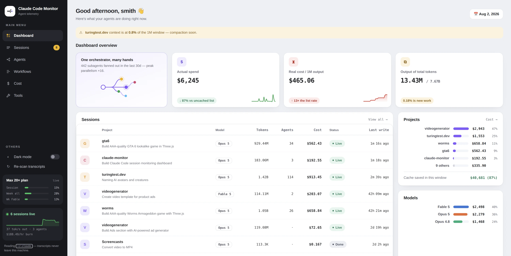

<div align="center">

# Claude Code Monitor

**Observability for Claude Code** — live sessions, subagents, workflow fan-outs,
token velocity and exact API cost, read straight from the transcripts
Claude Code already writes to `~/.claude/projects/`.

[](https://www.python.org/)
[](LICENSE)




</div>

Your transcripts never leave the machine — everything is computed from local
files and `/proc`. The one outbound request is to Anthropic's usage endpoint,
for the plan-limit card in the web UI, authorized by the OAuth token Claude
Code already stores. `cmon web --no-network` turns that off and falls back to
Claude Code's own cached copy.

## Quick start

```bash
pip install -r requirements.txt   # rich, psutil, flask
./cmon web --open                 # web UI at localhost:8787
./cmon                            # or the terminal dashboard
```

Optionally put it on your `PATH`:

```bash
ln -s "$PWD/cmon" ~/.local/bin/cmon
```

## Commands

| Command | What it shows |
| --- | --- |
| `cmon web` | **Browsable web UI** — everything below, plus drill-down and search |
| `cmon` · `cmon live` | Terminal dashboard — sessions, running agents, models, tools, cache |
| `cmon sessions` | Every session with tokens, peak context, throughput and cost |
| `cmon agents` | Subagent runs grouped by type, with per-agent cost and duration |
| `cmon workflows` | Workflow fan-outs, peak parallelism and cost per run |
| `cmon cost` | Daily / project / model breakdown, cost by token type, cache economics |
| `cmon tools` | Tool-call distribution, main thread vs subagents |
| `cmon show <id>` | Deep dive on one session — cost buckets, sparklines, agent table |
| `cmon report -o r.html` | Self-contained HTML report |
| `cmon reindex` | Rebuild the parse cache from scratch |

```bash
cmon sessions --days 7 --sort cost   # last week's most expensive sessions
cmon agents --type Explore           # just the Explore subagents
cmon cost --project worms --json     # machine-readable breakdown
cmon show a2eca144                   # session id prefix, title or project
```

Common flags: `--days N`, `--project NAME`, `--model NAME`, `--limit N`, `--json`.
`cmon live` also takes `--interval`, `--window HOURS` and `--live-only`.

## What it measures

- **Cost** — per-call attribution against list prices, cache reads at 0.1× input
  and writes at 1.25× (5m TTL) or 2× (1h TTL). A session that switches models is
  split by the actual model per call, never apportioned — tiers differ by 10×.
- **Token velocity** — live output tok/s across running sessions, plus per-session
  throughput from `turn_duration` records so idle time doesn't dilute it.
- **Context pressure** — peak and per-call context size, so you can watch a
  session approach the window before it compacts.
- **Subagents & workflows** — every `Agent` and `Workflow`-spawned run with topic,
  model, tools, duration and cost. Fan-outs report *peak parallelism*: the most
  agents alive at once, from a sweep over start/end times.
- **Prompts & files** — what you actually typed (harness-injected text filtered
  out via `origin.kind`) and which files a session edited. Any session's prompts
  export to structured JSON or a self-contained HTML page, re-read from the
  transcript so nothing is truncated.
- **Resources** — live sessions matched to their OS process by working directory
  and activity window: CPU, RSS, thread count. Concurrent sessions in the same
  directory are disambiguated by recency.
- **Cache economics** — hit rate, 5m/1h write split, and the counterfactual bill
  if every cached token were repriced at the full input rate.
- **Git activity** — repos are discovered from session working directories and
  sampled with read-only `git` commands: uncommitted lines by tier, lines
  committed today, ahead/behind, changed files by churn, recent commits.
  Sampling cadence tiers by recency (live repos every 5s, idle ones rarely).

<details>
<summary><b>Web UI pages</b></summary>

<br>

| Page | What's there |
| --- | --- |
| **Overview** | Live sessions with CPU/RSS, daily spend, cost composition, weekday×hour heatmap, project and model splits |
| **Projects** | One card per project; each project's home hub links to its scoped Sessions, Agents, Workflows, Git, Cost and Tools |
| **Sessions** | Every session, searchable across titles *and prompt text* |
| **Session** | Context growth, cumulative spend, cost composition, tools, per-model split, subagent table, your prompts (exportable as JSON or a standalone HTML page), files touched |
| **Agents** | Log-scale cost distribution with percentiles, breakdown by type, sortable run table |
| **Agent** | The exact prompt it was given, what it returned, tools used, cost |
| **Workflows** | Gantt view of each fan-out — one bar per agent, so parallelism is visible |
| **Git** | Live git state of every repo Claude worked in — WIP lines (staged/unstaged/untracked), committed vs uncommitted chart with commit markers, per-repo files & commits |
| **Cost** | Counterfactual, daily spend, per-project and per-model tables with rates |
| **Tools** | Main-thread vs subagent split per tool |

```bash
cmon web --host 0.0.0.0 --port 9000   # ⚠ no authentication — see below
cmon web --no-network                 # never call Anthropic for plan limits
```

The sidebar carries a dark-mode switch, a re-scan button and a live-telemetry
panel; every page has a time-window selector. Live state polls every 3s, the
overview refreshes every 12s.

**The server has no authentication.** On the default `127.0.0.1` that is fine —
only this machine can reach it. Binding anywhere else hands your prompts, file
paths and project names to everyone who can reach the port, and `cmon web`
warns when you do. Requests must arrive with a `Host` of `localhost` or an IP
literal and a same-origin `Origin`, which blocks DNS-rebinding and CSRF from
whatever else the browser has open.

</details>

<details>
<summary><b>Two things worth knowing about the numbers</b></summary>

<br>

**Records are deduplicated.** When a session or agent resumes, Claude Code
replays earlier messages into the transcript, so the same billed API call can
appear many times in one file. Records are keyed on `message.id` + `requestId`
and counted once per session. Skipping this inflates output tokens by roughly
5× — on one measured session, 7,229 raw assistant records collapsed to 4,009
real API calls.

**Token totals count cache reads once per call, because that is how they bill.**
A long session therefore reports far more tokens than its transcript contains:
the same context is re-read on every call. This is why `cmon cost` reports an
*effective cost per 1M output tokens* — total spend divided by output tokens.
It typically lands an order of magnitude above the list output rate, and it is
the number that actually describes what agentic work costs.

</details>

<details>
<summary><b>Accuracy & the agent-label caveat</b></summary>

<br>

Costs are **API list-price equivalents**, not amounts billed — a subscription
plan will differ. Retired models are priced at their last known rates and marked
with `*` in `cmon cost`. Cross-checked against an independent analysis of the
same session: per-agent costs agree exactly, totals within 1.4%.

An agent's short label comes from the `.meta.json` sidecar Claude Code writes
next to each subagent transcript. It is right in the large majority of cases but
occasionally stale on a resumed agent — one measured agent labelled "Map
generation" was in fact building the post-processing chain. The agent page
therefore also shows the task line and the `YOU OWN:` scope from the prompt
itself, so the real work is always visible. Duplicate labels within a session
fall back to the prompt automatically; beyond that the tool surfaces both rather
than guessing.

</details>

<details>
<summary><b>Performance & layout</b></summary>

<br>

The first run parses every transcript and caches the result in
`~/.cache/claude-monitor/`. Later runs re-parse only files whose size or mtime
changed — one `stat` per transcript. The live dashboard uses the same path, so a
refresh costs a few stats plus a parse of whichever file is actively being
written.

```
claude_monitor/
  web/
    server.py    Flask JSON API + static hosting
    static/      app.js (router, views, SVG charts), style.css
    templates/   index.html
  pricing.py     model rates, cache multipliers, cost math
  models.py      Session / AgentRun / Usage / ModelStat
  parser.py      incremental JSONL parser + on-disk cache + dedup
  analytics.py   aggregation: cost, velocity, workflows, cache, economics
  resources.py   process discovery and PID→session attribution
  gitmon.py      git sampling for repos discovered from sessions
  dashboard.py   live rich TUI
  report.py      standalone HTML report
  cli.py         argparse entry point
```

</details>

## License

MIT © Kaloyan Chernev
